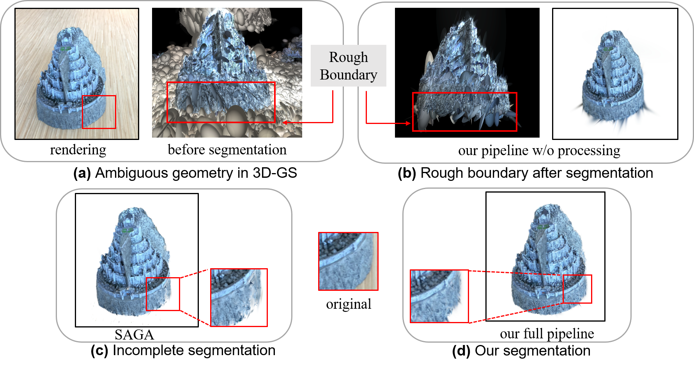
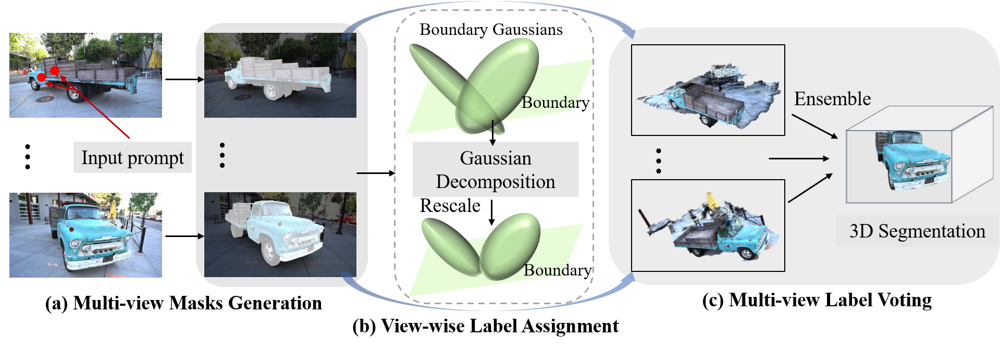
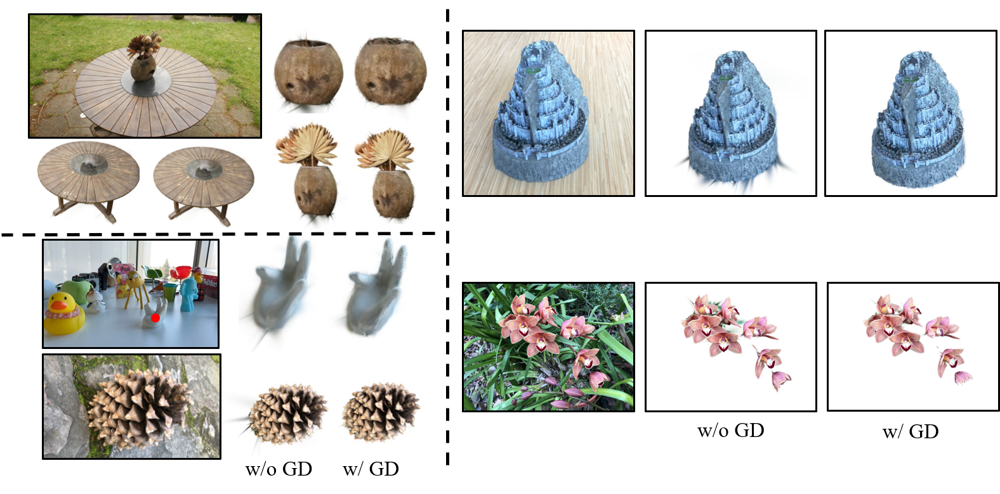
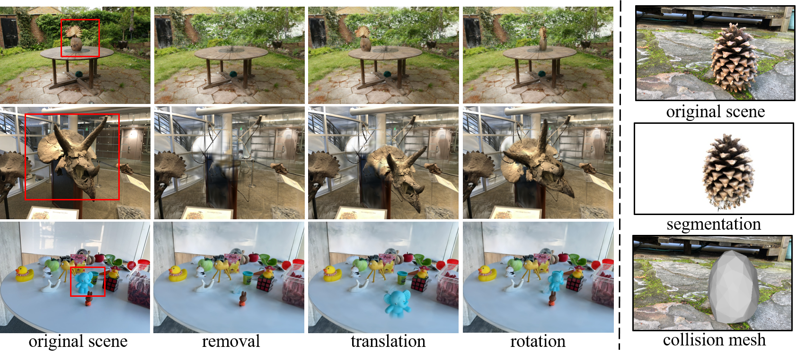

# SAGS (Segment Anything in 3D Gaussians)
> [**Segment Anything in 3D Gaussians**](https://arxiv.org/abs/2401.17857)

## Introduction
3D Gaussian Splatting has emerged as an alternative 3D representation for novel view synthesis, benefiting from its high-quality rendering results and real-time rendering speed. However, the 3D Gaussians learned by 3D-GS have ambiguous structures without any geometry constraints. This inherent issue in 3D-GS leads to a rough boundary when segmenting individual objects. To remedy these problems, we propose SAGD, a conceptually simple yet effective boundary-enhanced segmentation pipeline for 3D-GS to improve segmentation accuracy while preserving segmentation speed. Specifically, we introduce a Gaussian Decomposition scheme, which ingeniously utilizes the special structure of 3D Gaussian, finds out, and then decomposes the boundary Gaussians. Moreover, to achieve fast interactive 3D segmentation, we introduce a novel training-free pipeline by lifting a 2D foundation model to 3D-GS. Extensive experiments demonstrate that our approach achieves high-quality 3D segmentation without rough boundary issues, which can be easily applied to other scene editing tasks.

<div align=center>

</div>

## Overall Pipeline
<div align=center>

</div>

(a) Given a set of clicked points on the 1st rendered view, we utilize SAM to generate masks for corresponding objects under every view automatically; (b) For every view, Gaussian Decomposition is performed to address the issue of boundary roughness and then label propagation is implemented to assign binary labels to each 3D Gaussian; (c) Finally, with assigned 3D labels from all views, we adopt a simple yet effective voting strategy to determine the segmented Gaussians.

## Installation
Clone the repository
```
git clone https://github.com/XuHu0529/SAGS.git
cd SAGS
```
Install the dependencies of 3D-GS:
```
cd gaussiansplatting/submodules

# a modified gaussian splatting (+ depth, alpha rendering)
git clone --recursive https://github.com/ashawkey/diff-gaussian-rasterization
pip install ./diff-gaussian-rasterization

pip install ./simple-knn
```
Install SAM and Grounding-DINO：
```
# Installing SAM
cd ../

mkdir dependencies; cd dependencies 
mkdir sam_ckpt; cd sam_ckpt
wget https://dl.fbaipublicfiles.com/segment_anything/sam_vit_h_4b8939.pth
git clone git@github.com:facebookresearch/segment-anything.git 
cd segment-anything; pip install -e .

# Installing Grounding-DINO
git clone https://github.com/IDEA-Research/GroundingDINO.git
cd GroundingDINO/; pip install -e .
mkdir weights; cd weights
wget https://github.com/IDEA-Research/GroundingDINO/releases/download/v0.1.0-alpha/groundingdino_swint_ogc.pth
```

## Usage
- Train 3D-GS
  
  We inherit all attributes from the original 3DGS, and more information about training the Gaussians can be found in their repo.
  ```
  python train.py -s <path to COLMAP or NeRF dataset> -m <path to saving trained model>
  ```
- Interactive Segmentation
  
  We use the jupyter notebook to perform segmentation. Please refer to `segmentation.ipynb` for instructions.

Some tips:
- `--gd_interval`

  Not all views need to decompose Gaussians. For common scenes, 4 or 5 decompositions are enough.

## TODO
- [ ] Refine the code implementation of Gaussian Decomposition. The current codes are a little time-consuming.
- [ ] A GUI for interactive usage.

## Segmentation Results

## Boundary-Enhanced Segmentation
Gaussian Decomposition (GD) is proposed to address the issue of roughness boundaries of 3D segmented objects, which results from the non-negligible spatial sizes of 3D Gaussian located at the boundary.
<div align=center>

</div>

## More Applications
After segmentation, we can directly apply to scene editing tasks, such as object removal, translation, and rotation, and extract collision meshes.
<div align=center>

</div>

## Citation
If you find this project useful for your research, please consider citing the report and giving a ⭐.
```
@article{hu2024semantic,
  title={Semantic Anything in 3D Gaussians},
  author={Hu, Xu and Wang, Yuxi and Fan, Lue and Fan, Junsong and Peng, Junran and Lei, Zhen and Li, Qing and Zhang, Zhaoxiang},
  journal={arXiv preprint arXiv:2401.17857},
  year={2024}
}
```
